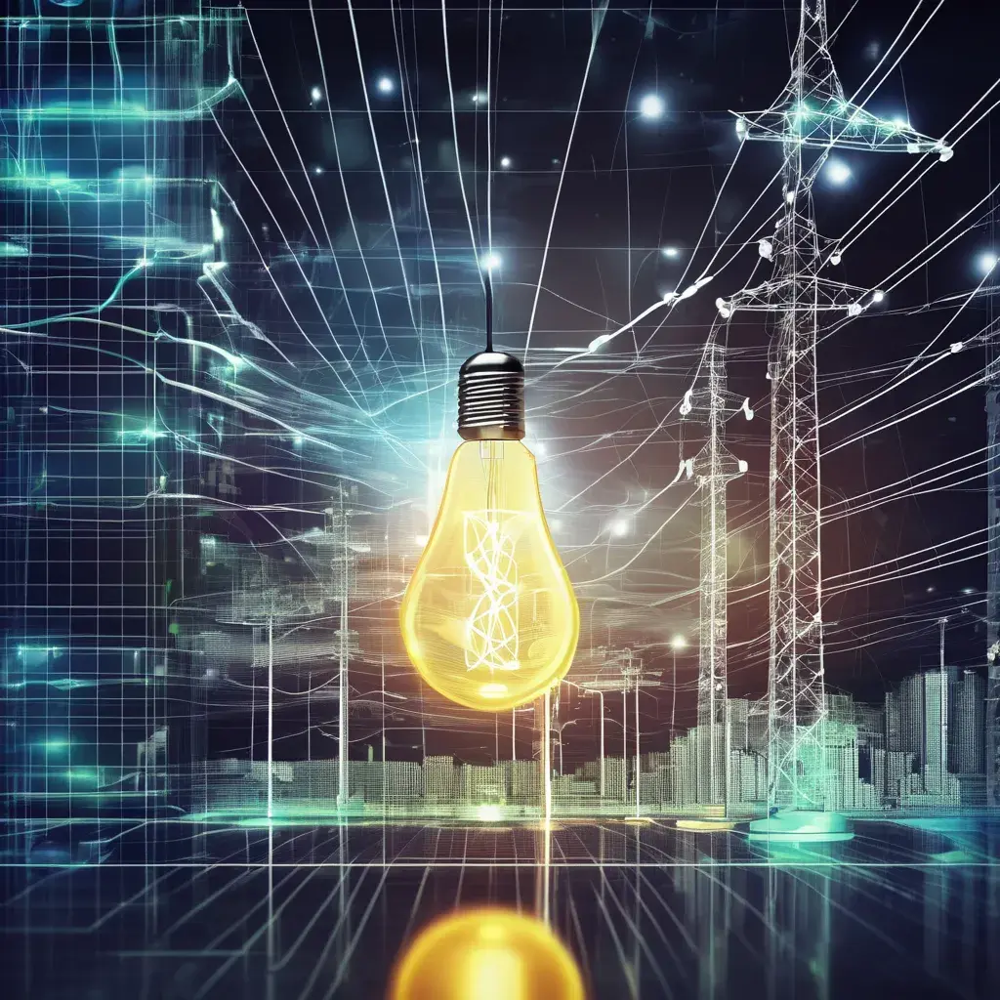

# Czeching the change: An analysis of Electricity Prices and Their Drivers in Czechia
### 1. **Project Definition**
   - **Objective:** Analyze historical electricity prices in Czechia to identify trends, seasonal patterns, and potential factors influencing price changes.
   - **Key Questions:**
     - What are the trends in electricity prices over time?
     - Are there seasonal patterns in electricity prices?
     - What external factors (e.g., weather, energy demand, market regulations) correlate with price changes?
### 2. **Data Collection**
   - **Sources of Data:**
     1. **Electricity Prices:** Look for historical electricity price data from reliable sources like the Czech Statistical Office (CZSO), the European Network of Transmission System Operators for Electricity (ENTSO-E), or the International Energy Agency (IEA).
     2. **External Factors:** Gather data on potential influencing factors such as weather conditions (temperature, precipitation), energy demand, fuel prices (e.g., natural gas, coal), and any regulatory changes.
     3. **Economic Indicators:** Consider adding economic data like GDP, inflation, or unemployment rates to see if there is a correlation with electricity prices.
### 3. **Data Preparation**
   - **Data Cleaning:**
     1. **Handle Missing Data:** Fill in or interpolate missing values in the dataset.
     2. **Convert Time Series:** Ensure all data is in the same frequency (e.g., daily, monthly) and format time columns correctly.
     3. **Normalize Data:** Adjust for inflation if needed or normalize datasets for comparison.
   - **Feature Engineering:**
     1. **Create New Features:** For instance, create features like average monthly temperature, or moving averages of electricity prices.
     2. **Lagged Variables:** Consider creating lagged variables (e.g., previous month’s prices) to study time-based effects.
### 4. **Exploratory Data Analysis (EDA)**
   - **Trends and Patterns:**
     1. **Time Series Plots:** Plot the electricity prices over time to identify any long-term trends or shifts.
     2. **Seasonality Analysis:** Use seasonal decomposition to separate the data into trend, seasonality, and residuals.
   - **Correlation Analysis:**
     1. **Correlation Matrix:** Check the correlation between electricity prices and potential influencing factors.
     2. **Scatter Plots:** Visualize relationships between electricity prices and variables like temperature or fuel prices.
### 5. **Time Series Analysis**
   - **Modeling:**
     1. **Seasonal Decomposition:** Apply seasonal decomposition of time series (STL) to understand the seasonality and trend.
     2. **ARIMA Modeling:** Fit an ARIMA model to forecast future electricity prices and assess the accuracy of your predictions.
   - **Comparative Analysis:** Compare electricity price trends with those of neighboring countries or regions to identify any unique patterns.
### 6. **Data Visualization**
   - **Trend Lines:** Use line charts to show electricity price trends over time.
   - **Seasonality:** Plot seasonal components separately to visualize monthly or quarterly patterns.
   - **Correlation Plots:** Use heatmaps or scatter plots to show relationships between electricity prices and other variables.
   - **Forecasting:** Visualize the forecasted prices against actual data.
### 7. **Insights and Reporting**
   - **Summary of Findings:**
     1. **Trends:** Discuss the overall trend in electricity prices (e.g., increasing, decreasing, stable).
     2. **Seasonality:** Highlight any significant seasonal effects (e.g., higher prices in winter).
     3. **Influencing Factors:** Discuss which factors (e.g., fuel prices, demand) are most strongly correlated with electricity prices.
   - **Recommendations:**
     1. **For Consumers:** Tips on when electricity might be cheaper based on seasonal trends.
     2. **For Policymakers:** Suggestions on how to stabilize prices or mitigate sharp increases.
   - **Visualization Dashboard:** Create a simple dashboard using tools like Tableau, Power BI, or a Python-based solution (e.g., Dash) to present your findings interactively.
### 8. **Further Exploration**
   - **Scenario Analysis:** Assess how potential future changes (e.g., shifts to renewable energy, new regulations) might impact electricity prices.
   - **Comparative Studies:** Extend the analysis to compare Czechia’s electricity prices with those of other EU countries.
### Tools You Might Use:
- **Python/R:** For data analysis, modeling, and visualization (Pandas, Matplotlib, Seaborn, Statsmodels).
- **Excel:** For simple data cleaning and basic analysis.
- **Tableau/Power BI:** For creating interactive visualizations and dashboards.
This project will not only help you practice data analysis and visualization but also give you insights into the energy sector in Czechia. Good luck with your analysis!

[def]: ~electricity.png